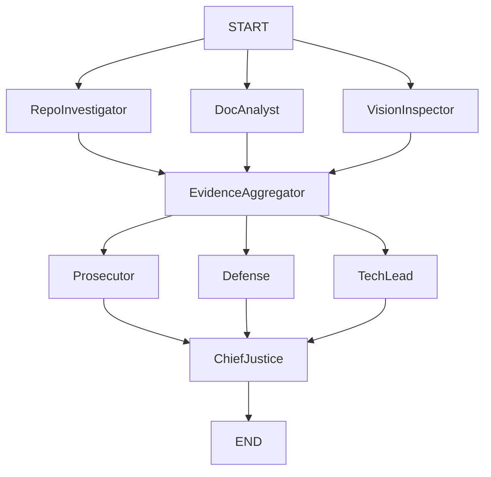

# Interim Report: The Automaton Auditor

## Architecture Decisions

This project is built using a Hierarchical State Graph managed by `langgraph` and heavily relies on strict, typed State propagation.

### Pydantic over dicts
Using `pydantic` `BaseModel` guarantees typed struct extraction. This is particularly valuable given LLMs are orchestrating the evidence evaluation process, forcing structured outputs (via `.with_structured_output`) removes the hallucination variable and prevents parsing logic failures.

### Sandboxing Strategy
To mitigate Remote Code Execution vulnerabilities, external repositories are cloned into Python `tempfile.TemporaryDirectory` instances. All processing (`git log`, `ast` parsing) occurs within this isolated, ephemeral container, reducing security impact on the runtime environment.

### AST Parsing Structure
Direct regex is incredibly brittle against code formatting. Python's built-in `ast` module guarantees structural parsing to definitively assert `StateGraph` usage, `operator` reducer assignment, and concurrent layout verification without executing untrusted code.

## Known Gaps & Planning

Phase 1 (Detectives) and Phase 2 (Judicial Layer) are fully sketched out.
The `VisionInspector` is currently partially mocked out as extraction of images and multi-modal integration isn't strictly necessary per the initial rubric bounds, but space has been allocated within the Fan-Out logic.

## Diagram

